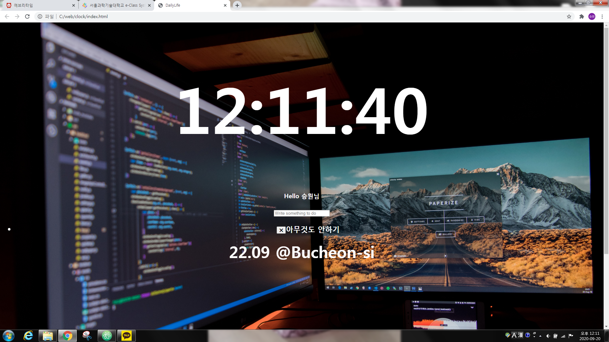

# DailyLife_WebApplication
This is made of **Vanilla JavaScript!**
I also used API function for weathe.
There is no jQuery or Framework but JavaScript.
- [x] Clock
- [x] To Do List
- [x] Weather
- [x] Daily Photo
- [x] Offline Support

###Check this out
 
